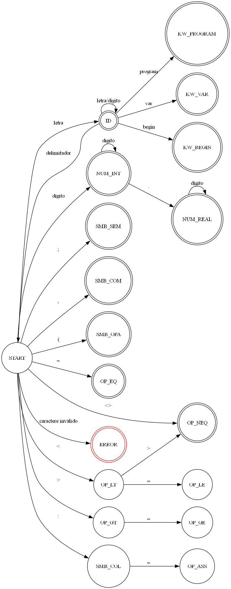

# Relatorio Tecnico - Analisador Lexico

## 1) Descricao das estruturas de dados

### 1.1 Estrutura principal de token
No codigo em [analisador.c](../analisador.c), a estrutura usada para representar um token e:

- nome: classe do token (ex.: KW_PROGRAM, ID, NUM_INT)
- tipo: categoria textual (ex.: palavra-chave, identificador)
- valor: lexema reconhecido
- lexema: campo reservado (nao e preenchido de forma consistente no estado atual)
- linha: linha da ocorrencia
- coluna: coluna da ocorrencia

### 1.2 Estruturas auxiliares
No estado atual, o analisador utiliza principalmente:

- contadores globais por categoria de token (palavras-chave, identificadores, numeros, simbolos e operadores)
- buffer local de lexema (array de char)
- array local de resultados de tokens com tamanho fixo (1000 posicoes)

Observacao: ainda nao existe uma tabela de simbolos completa persistida em arquivo no formato esperado da atividade.

## 2) Descricao das funcoes implementadas

### 2.1 createToken(char *lexema)
Responsavel por classificar um lexema lido:

- reconhece palavras-chave: program, var, begin, end, if, then, else, while, do, integer, real
- reconhece numeros inteiros e reais com base no primeiro caractere e presenca de ponto no lexema
- classifica como ID quando nao for palavra-chave nem numero
- incrementa contadores globais

### 2.2 lexicalAnalisis(int c, FILE *fp)
Le o arquivo caractere por caractere com fgetc e:

- controla linha/coluna
- acumula sequencias alfanumericas em buffer
- fecha token quando encontra delimitador
- imprime token reconhecido no console
- imprime alguns simbolos e operadores no console quando identificados

Limitacao importante:
- a condicao de delimitadores tratada atualmente cobre espaco, ;, :, (, )
- por isso, varios operadores e simbolos previstos no codigo e no AFD ainda nao entram corretamente no fluxo principal de reconhecimento

### 2.3 validateToken(struct Token token)
Funcao declarada, mas ainda sem implementacao efetiva.

### 2.4 isToken(char *lexema)
Funcao declarada e retornando 0 (placeholder).

### 2.5 writeFiles(Token token)
Funcao parcialmente implementada para futura gravacao em:

- .lex (tokens)
- .err (erros)
- .ts (tabela de simbolos)

No estado atual:
- assinatura e uso de tipo precisam ajuste para compilar
- comparacoes de string usam operador de igualdade em vez de strcmp
- a escrita de arquivos de saida ainda nao esta completa

## 3) Explicacao do AFD (com diagrama)

### 3.1 Arquivos do AFD
- Definicao em [afd.dot](../afd.dot)
- Imagem gerada em [afd.png](../afd.png)

### 3.2 Diagrama


### 3.3 Logica do automato
O AFD parte do estado START e cobre:

- Identificadores e palavras-chave:
  - START -> ID com letra
  - ID -> ID com letra/digito
  - ao finalizar lexema, valida palavras reservadas especificas (program, var, begin)
- Numeros:
  - START -> NUM_INT com digito
  - NUM_INT -> NUM_INT com digito
  - NUM_INT -> NUM_REAL com ponto
  - NUM_REAL -> NUM_REAL com digito
- Operadores:
  - reconhecimento de =, <, >, <=, >=, <>, :=
- Simbolos:
  - ; , ( :
- Erros:
  - qualquer caractere invalido vai para ERROR

Observacao:
- o AFD esta simplificado por comentarios no .dot e cobre apenas subconjunto de estados finais originalmente planejados.

## 4) Testes realizados (3 corretos e 3 com erro)

### 4.1 Status da execucao no ambiente desta analise
Nao foi possivel executar compilacao neste ambiente porque nao ha compilador C no PATH (gcc/clang/cl nao encontrados).

Mesmo assim, os casos de teste abaixo estao definidos e prontos para execucao local no seu ambiente.

### 4.2 Casos corretos

#### CT-01
Entrada:

```pascal
program teste ;
```

Esperado:
- reconhecimento de KW_PROGRAM
- reconhecimento de ID para teste
- reconhecimento de SMB_SEM para ;
- sem erro lexico

#### CT-02
Entrada:

```pascal
var x : integer ;
```

Esperado:
- KW_VAR
- ID (x)
- SMB_COL (:)
- KW_INTEGER
- SMB_SEM (;)
- sem erro lexico

#### CT-03
Entrada:

```pascal
begin while x do y ; end
```

Esperado:
- KW_BEGIN
- KW_WHILE
- ID (x)
- KW_DO
- ID (y)
- SMB_SEM
- KW_END
- sem erro lexico

### 4.3 Casos com erro

#### ET-01
Entrada:

```pascal
program @teste ;
```

Esperado:
- erro lexico para @ (caractere invalido)

#### ET-02
Entrada:

```pascal
var x $ integer ;
```

Esperado:
- erro lexico para $

#### ET-03
Entrada:

```pascal
x := 10 ;
```

Esperado no projeto final:
- OP_ASS para :=

Comportamento no estado atual:
- : e reconhecido como simbolo
- = tende a cair como caractere invalido no fluxo atual
- portanto, este caso evidencia lacuna de implementacao

## 5) Saidas geradas pelo analisador

### 5.1 Saida atual observavel
No estado atual, a saida principal e no console:

- Caractere lido: <c>
- Token: <NOME>, Valor: <LEXEMA>, Linha: <n>, Coluna: <n>
- <SMB_..., ...> e <OP_..., ...> para alguns simbolos/operadores
- Caractere invalido: <c>

### 5.2 Saidas de arquivo esperadas pela atividade
A atividade pede geracao de:

- arquivo .lex com tokens
- arquivo .err com erros lexicos
- arquivo .ts com tabela de simbolos

No codigo atual, essa etapa esta parcialmente iniciada em writeFiles, mas ainda nao finalizada.

## 6) Conteudo final da tabela de simbolos

### 6.1 Estado atual
Ainda nao ha implementacao completa da tabela de simbolos (estrutura + insercao + gravacao em .ts).

### 6.2 Conteudo esperado para os casos corretos definidos
Considerando CT-01, CT-02 e CT-03, uma tabela de simbolos minima esperada seria:

| Lexema | Classe sugerida |
|---|---|
| teste | ID |
| x | ID |
| y | ID |

Palavras reservadas normalmente nao entram como identificadores na tabela, apenas como tokens da linguagem.

## 7) Conclusao tecnica

- O projeto possui base funcional para leitura e classificacao inicial de lexemas.
- O AFD esta documentado e alinhado com a proposta da disciplina.
- Para fechar integralmente o checklist, faltam:
  - consolidar reconhecimento de todos operadores/simbolos no fluxo principal
  - implementar tratamento completo de erros e escrita de .err
  - implementar tabela de simbolos e escrita de .ts
  - implementar escrita de .lex de forma consistente
